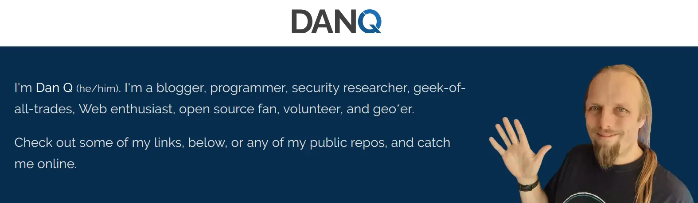

### Links 🔗

For the full Dan Q experience, start your journey at **[DanQ.me](https://danq.me/)**. Or for a more-eccentric portfolio, see **[Some Of My Things](https://things.danq.me/)**.

- 🕸️ Web/blog: [DanQ.me](https://danq.me/)
- 📄 CV/resume: [DanQ.me/cv](https://danq.me/cv/)
- 🚀 Gemini: ```gemini://danq.me```
- 🐘 Mastodon: [@dan@danq.me](https://m.danq.me/@dan)
- 😄 Pronouns: he/him
- 🤩 A selection of things I'm proud of:
  - Founded tech nonprofit [@ThreeRingsCIC](https://github.com/ThreeRingsCIC), whose Rails app facilitates around 20,000 hours of volunteer effort _every day_
  - Created [FreeDeedPoll.org.uk](https://www.freedeedpoll.org.uk/), helping thousands of British citizens change their names for free without a solicitor
  - Rescued and resurrected Randal Mundoe's (of XKCD fame) [Geohashing.site](https://geohashing.site/) and made it available for a new generation
  - Blogged virtually nonstop about life, technology, and the space in-between them for 28+ years

<p align="center"><a href="https://danq.me"></a> <a href="https://danq.me"></a></p>
